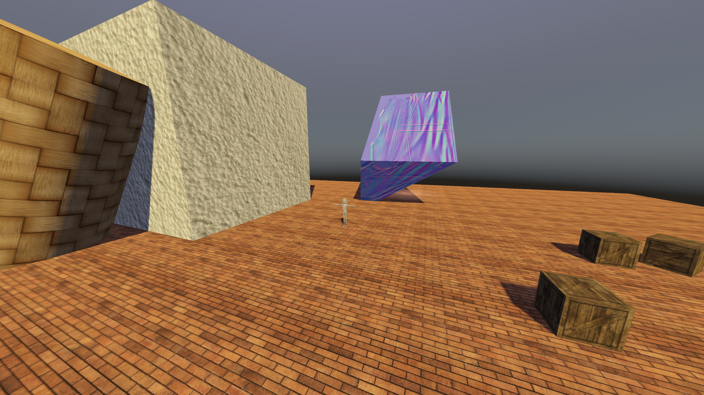
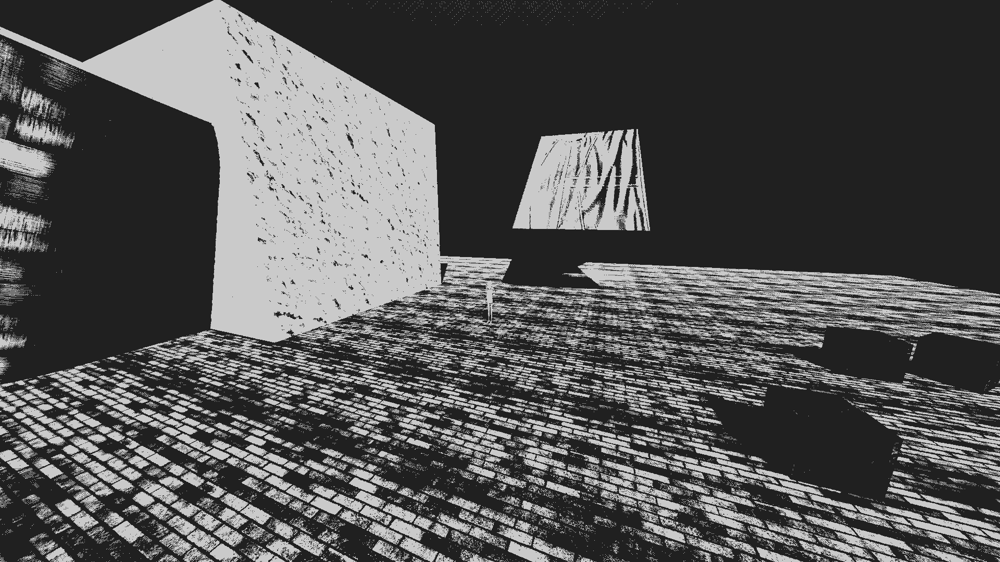
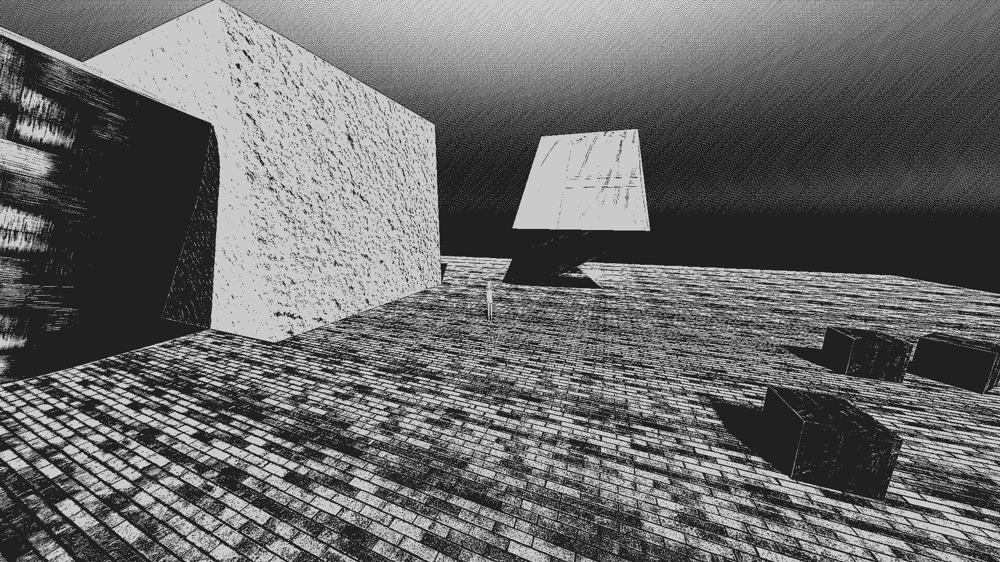
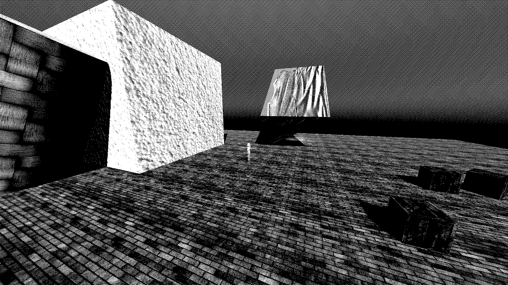
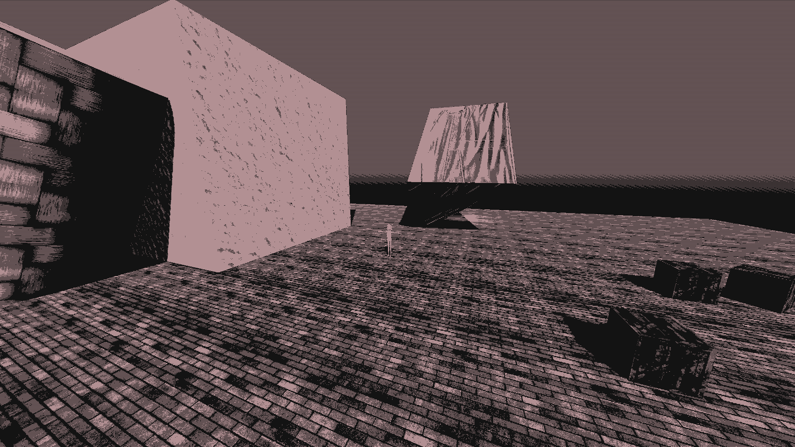
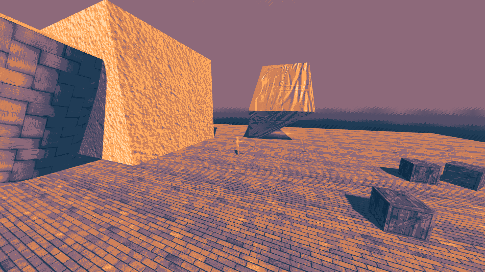
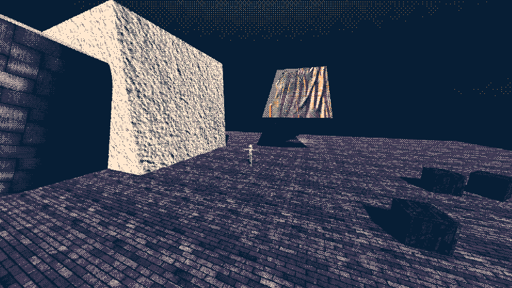
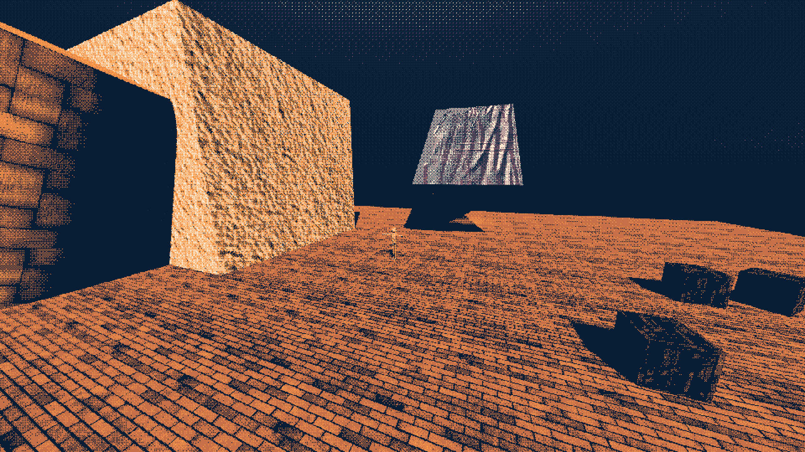
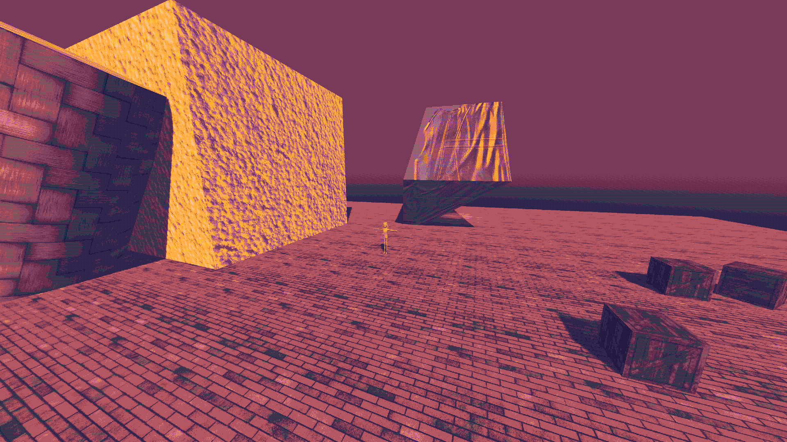

# ✨ VesperaFX - Modular Post-Processing Shader Suite

_Includes: Dithering, palette mapping, pixelation, sharpening, color
correction, CRT effects, and VHS effects._\
_Modular. Yankable. Yours to break._

**VesperaFX** is a modular, stylized post-processing shader for **Godot 4.4.1**,
featuring dithering, palette-based color mapping, pixelation, sharpening,
CRT/VHS effects, and flexible color adjustments.\
Designed for retro visuals, game feel tweaking, and full control over your
post-FX pipeline.

> [!IMPORTANT]
> This repo is not supposed to be a one-size-fits-all solution. It is a
> toolbox of modular effects you can pick and choose from. Feel free to yank
> ONLY what you need!

<p align="center">
	
</p>

> Btw, this GIF is actually an older version of the shader. The current one has
> way more features!

<details>
<summary><h3>Examples of shading</h3></summary>

## Unshaded

<p align="center">
	
</p>

## 2 Palette Black-White

<p align="center">
	
</p>

## 2 Palette Black-White + Sharpening

<p align="center">
	
</p>

## 2 Palette True Black-White with Level 4 Dithering

<p align="center">
	
</p>

## 2 Palette True Black-White with Level 4 Error Diff Dithering with Color Correction (Hue Shift)

<p align="center">
	
</p>

## 5 Palette with Default Params

<p align="center">
	
</p>

## 5 Palette Level 2 Dithering with Color Correction + Pixelation

<p align="center">
	
</p>

## 5 Palette Level 2 Dithering, RGB Matching and Color Correction + Pixelation

<p align="center">
	
</p>

## 5 Palette Level 2 Error Diff Dithering with Color Correction

<p align="center">
	
</p>
</details>

## 🎨 Features

- ✅ Dithering (multiple modes: Bayer, Noise, Floyd-Steinberg, Blue Noise)
  - 🔄 Runtime-selectable dithering mode (via uniform toggle)
- ✅ Palette-based color mapping via luminance, brute-force RGB, or LUT
  - 🔄 Optional LUT/texture blend for smooth transitions
- ✅ Pixelation with custom grid size
- ✅ Sharpening (multiple kernels: Laplacian, Unsharp Mask, Bilateral, High Boost)
- ✅ Color adjustments: hue, saturation, contrast, gamma
- ✅ PS1-style vertex jitter effects
- ✅ CRT effects
  - Vignette (edge darkening)
  - Scanlines (resolution-aware)
  - Barrel/Pincushion warp (separate X/Y control)
  - Black bars (letterbox/pillarbox)
- ✅ VHS effects
  - Chromatic aberration (RGB offset)
  - Tracking lines (animated distortion bands)
  - Noise/grain (animated static)
- 🧱 Modular `.gdshaderinc` files. Use only what you need.

## 📦 Implementation

1. Clone or copy the shader files into your project. You'll find each effect in
   the `include/` directory.
2. Create a new `.gdshader` file in your project.
3. Include the modules you want (or everything) using:

```glsl
#include "res://path/to/include/dither.gdshaderinc"
#include "res://path/to/include/palette.gdshaderinc"
```

4. Copy relevant logic from
   [`void fragment()` in `main.gdshader`](main.gdshader) or build your own.

## 🧪 Usage Notes

- RGB palette matching uses brute-force comparison per pixel. This is slow.
  Consider using precomputed LUT for better performance.
- Pixelation + Sharpening may cause artifacts. There's a flag
  (`#define ALLOW_PIXELATION_SHARPEN_COMBO`) to allow it, but it's not
  recommended unless you really want it.
- Effect order defaults to: Dither -> Palette Map. You can flip it by:
  `#define REVERSE_DITHER_PALETTE_MAPPING`.
- LUT/texture blending computes both mappings simultaneously. Enable with
  `#define ALLOW_PALETTE_LUT_BLEND`. May impact performance on low-end GPUs.
- You may also include `utils.gdshaderinc` for constants and shared helpers.

## ⚙️ Files

| File                     | Purpose                                  |
| ------------------------ | ---------------------------------------- |
| `dither.gdshaderinc`     | Multiple dithering modes                 |
| `palette.gdshaderinc`    | Palette mapping (RGB, luminance, LUT)    |
| `pixelation.gdshaderinc` | Pixel grid reduction                     |
| `sharpening.gdshaderinc` | Sharpen filters (multiple kernels)       |
| `rendering.gdshaderinc`  | Hue/saturation/contrast/gamma            |
| `ps1.gdshaderinc`        | PS1-style texture jitter                 |
| `crt.gdshaderinc`        | CRT effects (vignette, scanlines, warp)  |
| `crt.gdshaderinc`        | VHS effects (chromatic, tracking, noise) |
| `utils.gdshaderinc`      | Shared utility functions                 |

> You can yank one or all. Everything is compartmentalized.

## 📜 License

This shader is released under the [Mozilla Public License 2.0](LICENSE.txt).

Credit is optional, but always appreciated.\
Author: André Albanese Junior (@patomcio / @devkcud)

## 🧯 Support

This isn't a framework, it is a toolbox. If you need help integrating or
customizing, feel free to reach out via GitHub issues or social media.

---

⭐ If you find this repo useful, consider starring! :D
