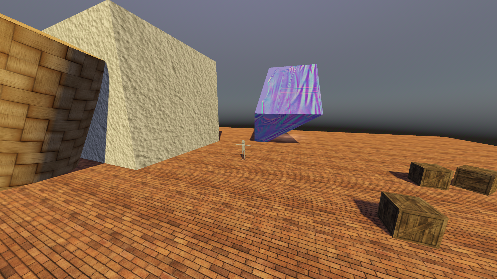
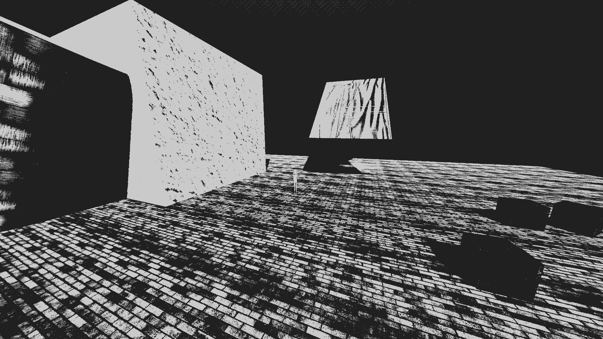
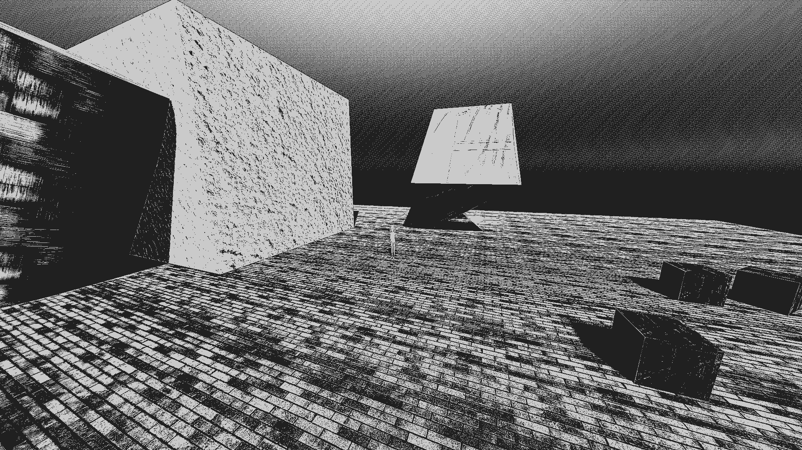
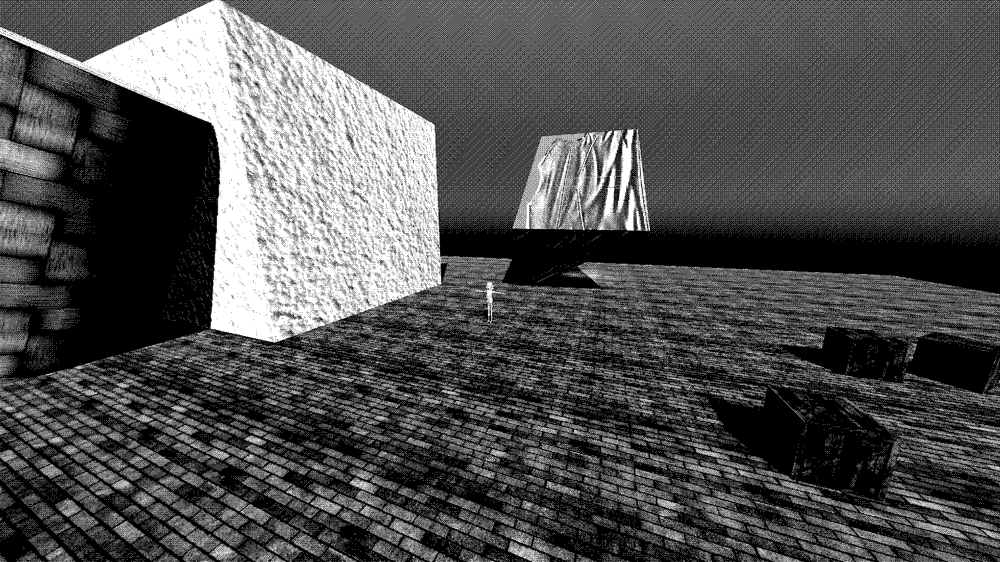
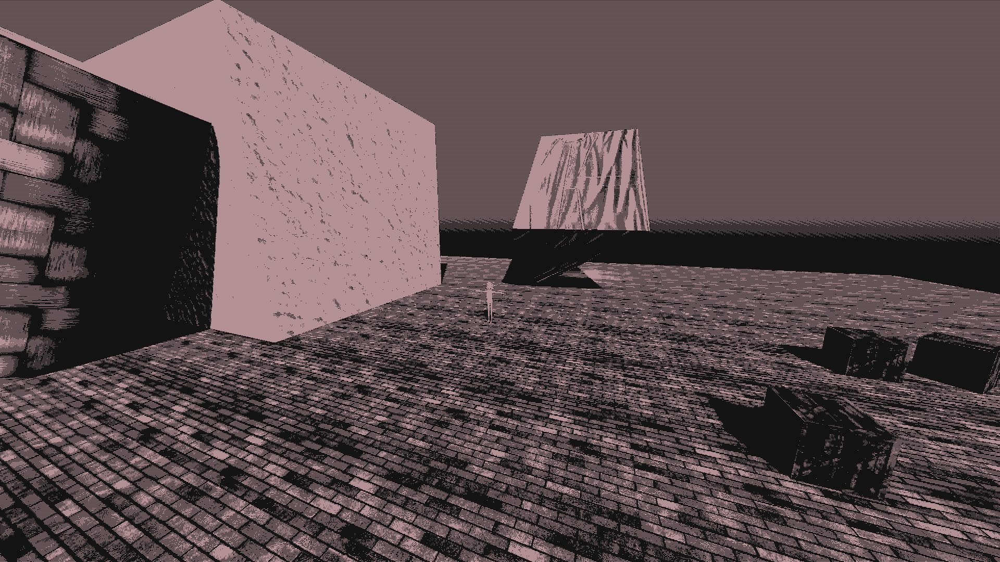
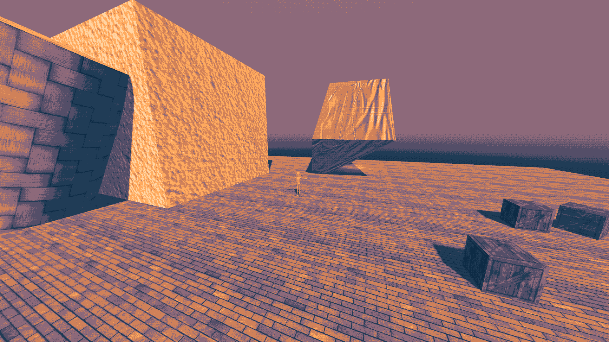
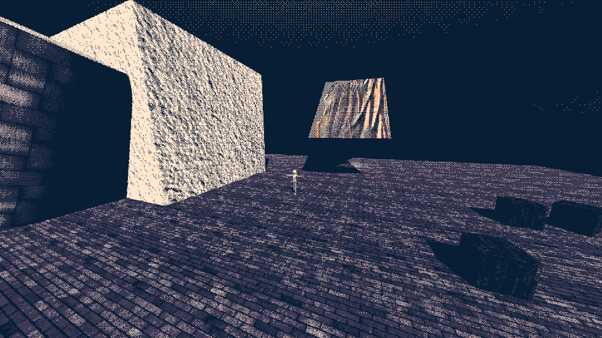
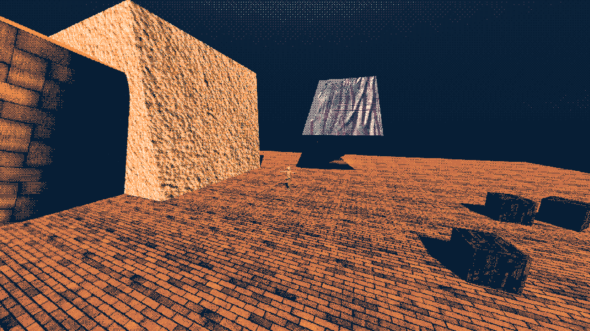
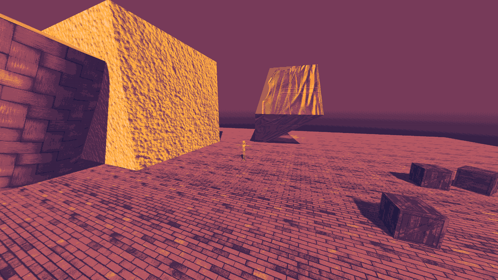

# ✨ VesperaFX - Modular Post-Processing Shader Suite

_Includes: Dithering, palette mapping, pixelation, sharpening, color
correction, CRT effects, VHS effects, psychedelic warp, and trails._\
_Modular. Yankable. Yours to break._

**VesperaFX** is a modular, stylized post-processing shader for **Godot 4.4.1**, featuring dithering, palette-based color mapping, pixelation, sharpening, CRT/VHS effects, psychedelic warp, trails, and flexible color adjustments.

Designed for retro visuals, game feel tweaking, and full control over your post-FX pipeline.

> [!IMPORTANT]
> This repo is not supposed to be a one-size-fits-all solution. It is a toolbox of modular effects you can pick and choose from. Feel free to yank
> ONLY what you need!

<p align="center">
	
</p>

> Btw, this GIF is actually an older version of the shader. The current one has way more features!

<details>
<summary><h3>Examples of shading</h3></summary>

## Unshaded

<p align="center">
	
</p>

## 2 Palette Black-White

<p align="center">
	
</p>

## 2 Palette Black-White + Sharpening

<p align="center">
	
</p>

## 2 Palette True Black-White with Level 4 Dithering

<p align="center">
	
</p>

## 2 Palette True Black-White with Level 4 Error Diff Dithering with Color Correction (Hue Shift)

<p align="center">
	
</p>

## 5 Palette with Default Params

<p align="center">
	
</p>

## 5 Palette Level 2 Dithering with Color Correction + Pixelation

<p align="center">
	
</p>

## 5 Palette Level 2 Dithering, RGB Matching and Color Correction + Pixelation

<p align="center">
	
</p>

## 5 Palette Level 2 Error Diff Dithering with Color Correction

<p align="center">
	
</p>
</details>

## 🎨 Features

Quite a few! Here's what you get:

- [x] Runtime editing via shader uniforms
- [x] Dithering
  - [x] Multiple modes:
    - [x] Bayer
    - [x] Noise
    - [x] Pseudo Floyd-Steinberg
    - [x] Blue Noise
    - [ ] Real Floyd-Steinberg
- [x] Palette-based color mapping via luminance, brute-force RGB, or LUT
  - [x] LUT/texture blend for smooth transitions
  - [x] Transitions between palette lines
  - [ ] Precomputed LUT support
- [x] Pixelation with custom grid size
- [x] Sharpening
  - [x] Configurable intensity
  - [x] Multiple kernel support
    - [x] Laplacian
    - [x] Unsharp Mask
    - [x] Bilateral
    - [x] High Boost
    - [ ] Edge Detection
- [ ] Cartoon/Toon shading
- [ ] Cartoon/Toon effects
  - [ ] Wobble
  - [ ] Swirl
  - [ ] Stretch
  - [ ] Outline
- [x] Drug effects
  - [x] Trails
  - [x] Chromatic aberration (via VHS)
  - [x] Psychedelic Warp
- [x] Color adjustments: hue, saturation, contrast, gamma
- [x] PS1-style vertex jitter effects (not really, tho)
- [x] CRT effects
  - [x] Vignette (edge darkening)
  - [x] Scanlines (resolution-aware)
  - [x] Barrel/Pincushion warp (separate X/Y control)
  - [x] Black bars (letterbox/pillarbox)
- [x] VHS effects
  - [x] Chromatic aberration (RGB offset)
  - [x] Tracking lines (animated distortion bands)
  - [x] Noise/grain (animated static)
- [x] Performance considerations (LUT blending, pixelation-sharpen combo)
- [ ] Spatial shader version
  - [ ] 3D dithering
  - [ ] Palette mapping for 3D scenes (LUT and RGB)
  - [ ] CRT/VHS effects for 3D scenes
  - [ ] Pixelation and sharpening for 3D scenes
- [ ] Demo scenes showcasing various effects and combinations
- [x] LUT generation tool
- [x] RGB palette generation tool

## 📦 Implementation

1. Clone or copy the shader files into your project. You'll find each effect in the `include/` directory.
2. Create a new `.gdshader` file in your project.
3. Include the modules you want (or everything) using:

```glsl
#include "res://path/to/include/dither.gdshaderinc"
#include "res://path/to/include/palette.gdshaderinc"
```

4. Start from [`main.gdshader`](main.gdshader) for a lean palette/dither/pixelation base, or copy one of the focused shaders in [`examples/`](examples/).

## 🧩 Shader Examples

`main.gdshader` is intentionally small. The heavier all-in-one version lives in `examples/all_effects_demo.gdshader` so production shaders can start from a closer fit.

| File                                       | Use when you need                       |
| ------------------------------------------ | --------------------------------------- |
| `main.gdshader`                            | Lean palette + dither + pixelation base |
| `examples/palette_dither.gdshader`         | Cheap retro palette/dither pass         |
| `examples/palette_lut_transition.gdshader` | Palette/LUT blend transitions           |
| `examples/pixel_crt.gdshader`              | Pixelation with CRT styling             |
| `examples/sharpening_only.gdshader`        | Isolated sharpening pass                |
| `examples/vhs_warp_trails.gdshader`        | VHS, chroma split, warp, and trails     |
| `examples/color_adjust.gdshader`           | Guarded color correction only           |
| `examples/all_effects_demo.gdshader`       | Full feature reference / stress test    |

## 🧪 Usage Notes

- `examples/all_effects_demo.gdshader` is a reference/stress-test shader, not the recommended production default.
- RGB palette matching uses brute-force comparison per pixel. This is slow. Consider using precomputed LUT for better performance.
- Pixelation + Sharpening may cause artifacts. There's a flag (`#define ALLOW_PIXELATION_SHARPEN_COMBO`) to allow it, but it's not recommended unless you really want it.
- Effect order defaults to: Dither -> Palette Map. You can flip it by: `#define REVERSE_DITHER_PALETTE_MAPPING`.
- LUT/texture blending computes both mappings simultaneously. Enable with `#define ALLOW_PALETTE_LUT_BLEND`. May impact performance on low-end GPUs.
- You may also include `include/utils.gdshaderinc` for constants and shared helpers.

## ⚙️ Files

| File                             | Purpose                                  |
| -------------------------------- | ---------------------------------------- |
| `include/dither.gdshaderinc`     | Multiple dithering modes                 |
| `include/palette.gdshaderinc`    | Palette mapping (RGB, luminance, LUT)    |
| `include/pixelation.gdshaderinc` | Pixel grid reduction                     |
| `include/sharpening.gdshaderinc` | Sharpen filters (multiple kernels)       |
| `include/rendering.gdshaderinc`  | Hue/saturation/contrast/gamma            |
| `include/ps1.gdshaderinc`        | PS1-style texture jitter                 |
| `include/crt.gdshaderinc`        | CRT effects (vignette, scanlines, warp)  |
| `include/crt.gdshaderinc`        | VHS effects (chromatic, tracking, noise) |
| `include/warp.gdshaderinc`       | Psychedelic sinusoidal UV warp           |
| `include/trails.gdshaderinc`     | Rotating radial trail accumulation       |
| `include/utils.gdshaderinc`      | Shared utility functions                 |
| `examples/*.gdshader`            | Focused starter shaders for combinations |

> You can yank one or all. Everything is compartmentalized.

## 📜 License

This shader is released under the [Mozilla Public License 2.0](LICENSE.txt).

## 🧯 Support

This isn't a framework, it is a toolbox. If you need help integrating or customizing, feel free to reach out via GitHub issues or social media.

---

⭐ If you find this repo useful, consider starring! :D
